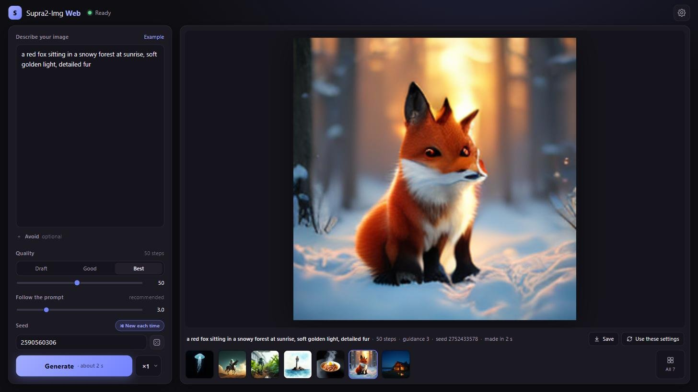

# Supra2-Img Web

Runs [Supra2-IMG](https://huggingface.co/SupraLabs/Supra2-IMG), SupraLabs' 104M-parameter
text-to-image model, **entirely in the browser** on WebGPU. The weights are downloaded once
(about 1 GB) and cached in the browser's Origin Private File System. Prompts and images never
leave the page.

**Live demo: [sm079.github.io/supra2-img-web](https://sm079.github.io/supra2-img-web/)** (recent Chrome
or Edge on a computer with a graphics card; the first visit downloads about 1 GB)

There is no ONNX/runtime dependency. The engine is a small set of hand-written WGSL kernels
(`app/gpu/`, adapted from [anima-studio](https://github.com/sm079/anima-studio)) that run the
fp32 weights directly.



- The same outputs as SupraLabs' `inference.py`: 256 × 256 images, Euler flow sampling with
  classifier-free guidance, seeds that match `torch.manual_seed` on the CPU
- Checked against PyTorch stage by stage (relative error ~1e-6 on the final image)
- About 2 s per image at the recommended 50 steps on a mid-range GPU
- Live previews, a generation queue, an optional negative prompt and a session gallery
- Runs in a Web Worker; resumable downloads; no server beyond static hosting

## Quick start

The app is static files (`index.html` and `app/`), so any static host works. Pushing to `main`
publishes them to GitHub Pages through `.github/workflows/pages.yml`. The model files are
downloaded from Hugging Face (see below).

```bash
python tools/serve.py                 # http://127.0.0.1:8080/ (any static server works)
```

Open the page in a WebGPU browser (recent Chrome or Edge) and press **Download & start**. Later
visits load from the browser's cache.

## Where the model files live

`tools/build_models.py` builds the five files the app needs from the original Hugging Face repos:

| file | contents | size |
|---|---|---|
| `supra2-img-ema.safetensors` | [Supra2-IMG](https://huggingface.co/SupraLabs/Supra2-IMG)'s diffusion transformer, converted from `model_final_ema.pt` | 397 MB |
| `flan-t5-base-encoder.safetensors` | [Flan-T5-Base](https://huggingface.co/google/flan-t5-base), encoder tensors only | 418 MB |
| `sd-vae-ft-mse-decoder.safetensors` | [sd-vae-ft-mse](https://huggingface.co/stabilityai/sd-vae-ft-mse), decoder tensors only | 189 MB |
| `tokenizer.json`, `tokenizer_config.json` | the Flan-T5 tokenizer | 2.3 MB |

Supra2-IMG is published as a pickled PyTorch checkpoint. The build reads it with
`torch.load(weights_only=True)` (PyTorch's restricted unpickler, which never runs code from the
file) and writes the EMA weights under their original names in float32, plus the checkpoint's
stored unconditional text embedding as `uncond_text` (its one unmasked row). All weights stay
float32; nothing is quantized.

The files are published in the Hugging Face model repo
[sm079/supra2-img-web](https://huggingface.co/sm079/supra2-img-web), and `MODELS_URL` in
`app/main.js` points at it, **pinned to a commit** (`…/resolve/<commit>/`). Browsers cache the
files by name, so after uploading new files, update the commit in `MODELS_URL`. Hugging Face
allows cross-origin reads and HTTP Range requests, so downloads come straight from its CDN and
interrupted downloads resume.

To rebuild and use the files locally:

```bash
pip install torch safetensors huggingface_hub
python tools/build_models.py          # -> models/
# then open http://127.0.0.1:8080/?models=./models/
```

## How it works

| part | implementation |
|---|---|
| Tokenizer | Flan-T5 Unigram through the vendored `@huggingface/tokenizers`; `</s>` appended, truncated to the checkpoint's 128-token context |
| Text encoder | Flan-T5-Base encoder, 12 layers, relative position bias, gated tanh-GELU FFN, fp32. Runs at the prompt's true length: masked padding changes nothing for real tokens |
| DiT | SupraDiT: 2×2 patches of the 4×32×32 SD latent → 256 tokens × 576, 14 blocks of AdaLN-Zero self-attention, cross-attention to the projected T5 states and a tanh-GELU MLP, learned position embedding |
| Sampling | t = i/steps from noise (0) to image (1), `z += dt · v`. With guidance > 1 the conditional and unconditional passes run as one batch, and `v = v_u + s(v_c − v_u)` |
| Unconditional | the embedding stored in the checkpoint, as `inference.py` uses; a negative prompt ("Avoid") replaces it with the T5 encoding of that text |
| Preview | after each step, the current guess of the final latent is projected to RGB with ComfyUI's SD1.x latent→RGB factors (32 × 32, no VAE) |
| Noise | port of `torch.randn` on the CPU generator, so a seed gives the same image as `inference.py` run on a CPU. On CUDA, PyTorch draws different noise for the same seed |
| VAE | SD VAE decoder (sd-vae-ft-mse), NHWC implicit-GEMM 3×3 convs with fused 2× upsampling, GroupNorm, single-head mid-block attention |

Engine layout:

- `app/gpu/gemm.js`: tiled GEMM generator (fp32, 128×128 or 64×64 tiles, register prefetch,
  implicit im2col for convs, fused bias / GELU / SiLU / gated-residual epilogues)
- `app/gpu/kernels.js`: fused flash attention, LayerNorm with adaLN modulation, RMSNorm,
  GroupNorm, softmax with an additive bias (T5 relative positions)
- `app/models/`: `t5.js`, `dit.js`, `vae.js`. The DiT stacks every adaLN linear into one
  matrix, so a run's timestep conditioning for all steps is a single GEMM. Cross-attention
  keys and values are computed once per prompt.
- `app/pipeline.js`, `app/store.js`, `app/download.js`: orchestration, the OPFS cache and the
  resumable downloader
- `app/worker.js`, `app/engine.js`: the engine runs in a Web Worker (`?engine=page` runs it on
  the page)

## Verifying the engine

`tools/reference.py` runs the same models in PyTorch on the CPU in float32 (transformers'
T5EncoderModel, diffusers' AutoencoderKL, and an independent implementation of the SupraDiT
architecture), and dumps inputs and outputs. `tools/check.html` runs each WebGPU component on
the same inputs and compares them:

```bash
python tools/build_models.py
python tools/reference.py --out out/dump --dit
python tools/serve.py   # then open http://127.0.0.1:8080/tools/check.html
```

Results in Chrome, relative L2 error vs PyTorch:

| stage | rel. error |
|---|---|
| noise (`torch.randn`, CPU generator) | 1.8e-7 |
| tokenizer ids | exact |
| Flan-T5 hidden states | 3.2e-6 |
| DiT velocity, one step (cond / uncond) | 8.8e-7 / 9.8e-7 |
| final latent after 50 CFG steps | 1.1e-6 |
| final image | 1.7e-6 |
| VAE decode alone | 1.6e-6 |

Speed on the same machine: 38.5 ms per guided step (both passes), 0.2 s VAE decode, about
2.1 s for a 50-step image.

## Requirements

A WebGPU browser and a GPU with room for the fp32 weights (about 1 GB) plus a little working memory. The app calls
`navigator.storage.persist()` so the browser keeps the cached weights.

## License

The model weights keep their own licenses: Supra2-IMG (Apache-2.0), Flan-T5-Base (Apache-2.0),
sd-vae-ft-mse (MIT). The vendored tokenizer library is Apache-2.0.
